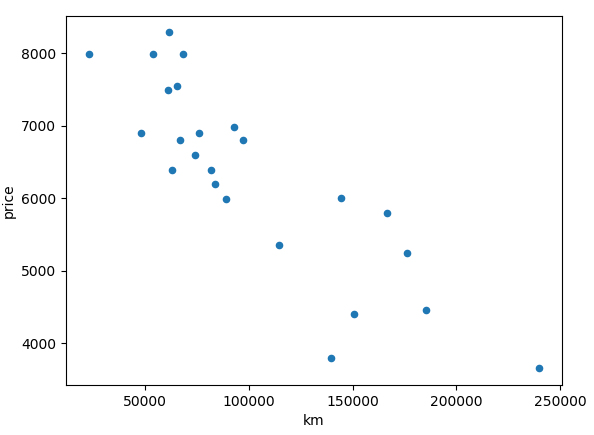
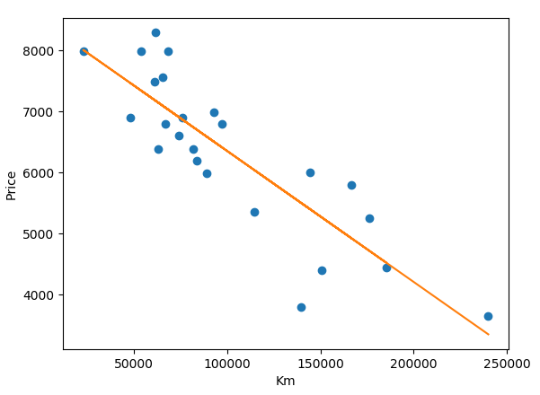
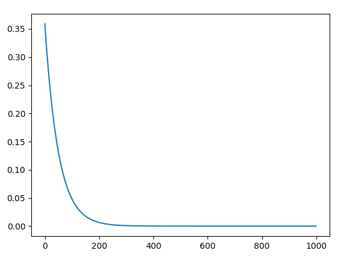

# Linear-regression

Dans ce projet je vais chercher à établir une relation linéaire entre plusieurs variables grace à un apprentissage automatique avec un set de données de prix de véhicule en fonction de leurs kilométrages


Je lance mon apprentissage automatique et après 1000 itérations


Visualisation de l'évolution du coût en fonction du nombre d'itérations

On peut voir qu'à partir de 300 itérations nous aurions pu arrêter l'apprentissage car n'arrivions pas à aller plus bas dans la courbe

## Usage

Commande pour entrainer notre modèle:
```
python3 compute.py data.csv
```
ce qui crée un fichier avec les thetas.csv


Puis pour trouver un prix en fonction d'un kilométrage
```
python3 predict.py thetac.csv
```
